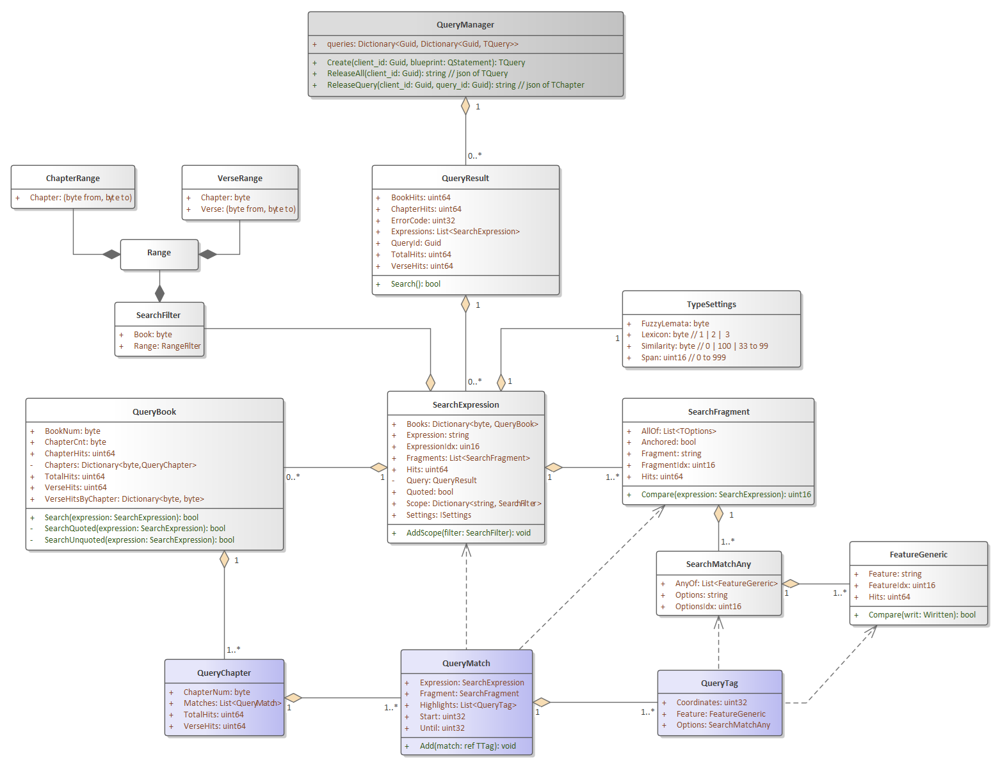
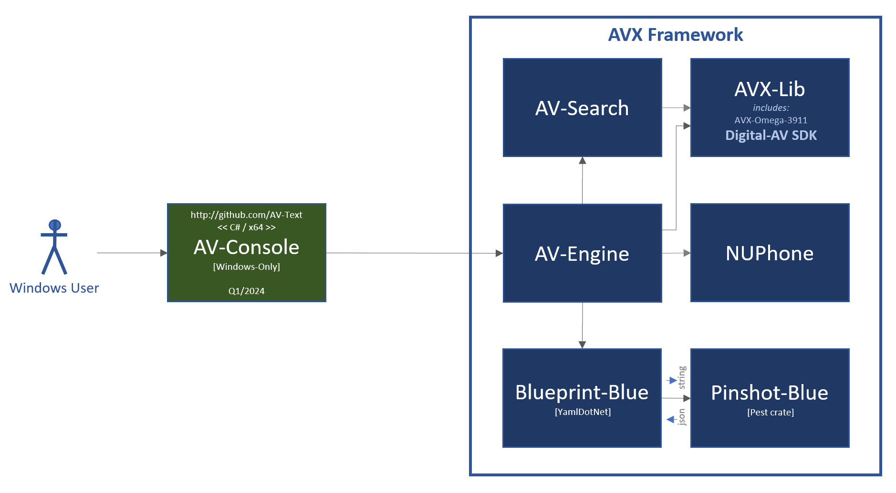
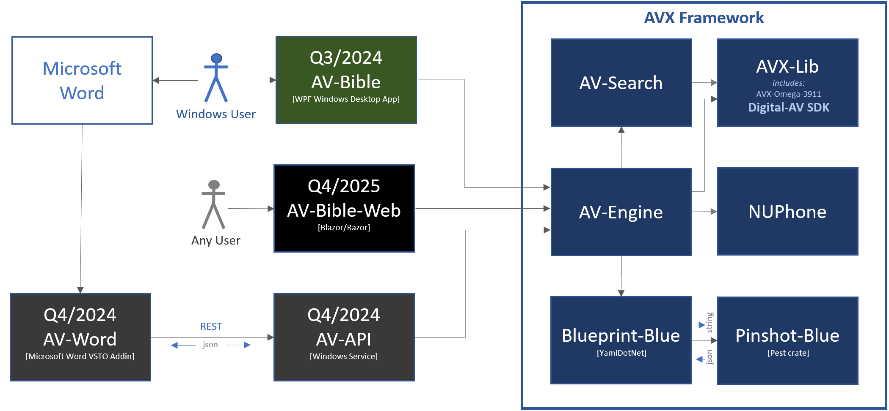

# AVX Framework

### Introduction

It's been a quarter century since the first release of AV-Bible for Windows. In its day, it was the world's first <u>free</u> bible software with a graphical user interface that ran on Microsoft Windows. It was originally released as: AV-1995, AV-1996, ... , until the final releases as AV-2008 & AV-2011. A companion software development kit (SDK) emerged along side AV-2008 and AV-2011. The SDK was renamed "Digital-AV" not long after its initial debut. Over the years, I developed a few freeware products on top of it. None were ever as significant as AV-Bible. The AV-Bible application name was resurrected in 2021 as a WPF application, built with the Digital-AV SDK. It is, has been, and always will be: free. 

With respect to the Digital-AV, you can rely on its foundation. With countless deployments and extensive text validation, Digital-AV has travelled the world and back with feedback from Christian missionaries, pastors, and lay people. They used it in their ministries. In return, I received treasured quality-control feedback. By 2008, all of the textual bugs were ironed out. Not coincidentally, 2008 was the first release of the SDK. Never making a dime, and pouring a healthy chunk of my life into this effort: it has been a labor of love.

AVX-Framework represents a radical step forward, at the same time as it reaches back to its roots. It began in the nineties as a fast & lean KJV search tool for Windows.  This modern framework is still fast & lean. They say, "The more things change, the more things stay the same." This cliche applies here. In its first incarnation, AV-Bible GUI was walled off from an in-memory database named "AV-Engine". AV-Engine is back! Once again, it walls-off the GUI apps from the processing engine. The new AV-Engine is .NET 8, and provides centralized access to the entire AVX-Framework. AVX-Framework has new linguistic features along with similarity searching, and even supports searching on parts-of-speech. It represents the most substantial improvement upon Digital-AV since its original inception.  

### Core Functionality

AV-Engine is the central point of access to the "AVX-Framework". Collectively, the AVX-Framework manifests the entire text of the bible with rich linguistic features. Under the hood, Digital-AV fully encodes: Strong's numbers, Lemmatizations, Part-of-Speech tags, named-entity types, [NUPhone representation](https://github.com/kwonus/NUPhone/blob/main/NUPhone.md), dual lexical [text] representations via its unique bi-text lexicon. With the debut of the "Omega" release, the Digital-AV SDK packs all of this information into a single compact binary file: it is fully indexed and its format is extensively [documented](https://github.com/kwonus/Digital-AV/blob/master/omega/Digital-AV-%CE%A939.pdf). The SDK lacked a comprehensive reference implementation until now. AVX-Framework fills the void: AV-Engine is the entry-point to the framework. The codebase of AVX-Framework augments AVX-Lib, but even this library itself is packed with updates. In all, AVX-Framework introduces a wealth of new features and functionality:

- sounds-alike searching via NUPhone Representation and the companion NUPhone dotnet assembly
- ability to precisely render text, with metadata from search to accommodate term-highlighting of matched query tokens
- complete support for dual lexicons 
- rich command/search language via the Pinshot-Blue library and its PEG grammar, conforming to the [Quelle specification](https://github.com/kwonus/Quelle/blob/main/Quelle-AVX.md).
- object-model representations of AVX dialect of the Quelle grammar via the Blueprint-Blue library
- AV-Engine library glues it all together

### Deeper Context

Incidentally, AVX is an abbreviation for **AV** e**X**tensions; AV itself is an abbreviation for **A**uthorized **V**ersion. The Authorized Version is the more proper name for the King James Bible. It is called that because it was <u>authorized</u> by the king (This is super significant in history: because prior to its authorization, it was illegal in England to publish an English translation of the scriptures, and punishable by death).

AVX-Framework offers unparalleled linguistic-search capabilities for the sacred text. Its fidelity of expression exceeds that found in most search-engines and command-languages. Quintessentially, AVX-Framework is a digital representation of the AV bible at its core. The framework coordinates a variety of capabilities: the high-linguistic-fidelity of Digital-AV is exposed via a rich grammar called [AVX-Quelle](https://github.com/kwonus/Quelle/blob/main/Quelle-AVX.md). Quelle grammar is concise, intuitive, and useful. Moreover, Quelle syntax facilitates sounds-alike searching, searching by lemma, searching by part-of-speech, wildcard searching, and equivalence-mapping of Elizabethan-English to/from modern-English search terms.

It's worthy to note: the AV/KJV bible is written in Elizabethan-English, sometimes called "Early Modern English". King James commissioned 47 translators of world renown. Contemporaries of Shakespeare, these 47 translators clearly identified their objective: "... ***to make GODS holy Trueth to be yet more and more knowen unto the people*** ..."  (in their own words, found in the introduction to the Authorized Version of 1611).

AV-Text Ministries has adopted their objective. Four centuries later, it resonates as if it had been spoken only yesterday. While this is a lofty goal, I wholeheartedly embrace it! With all of the features of Digital-AV exposed by Quelle, it allows the user to stay primitive, or search with deep nuances of language. It finds bible verses, whether queries be simple or complex. Leveraging this framework, developers are empowered by a powerful command language. Digital-AV manifests the most trustworthy English text that God has yet availed to mankind [The Authorized Version of 1611, with standardized spelling revisions of the 1769 edition]. Developers can concentrate on specific needs for various users and personas. The license is designed to be as free as the gospel. Use it as you see fit, hopefully to the glory of God. The 2024 release of AV-Bible will be the first application built atop AVX-Framework. Inspired by those before me, I want ***to make God's holy Truth to be yet more and more known!***

### Modular Framework with Minimal Dependencies

There is just a single external dependency of AVX-Framework, besides .Net 8.0: YamlDotNet. Dotnet is was chosen as it is open-source and cross-platform. YamlDotNet was chosen for its ability to parse/generate both YAML <u>and</u> JSON, along with its liberal open source license. JSON and P/Invoke serve as the glue to facilitate efficient communication from C# to Rust. There are internal dependencies; those also are all open source (maintained by AV Text Ministries; located at https://github.com/kwonus).  

The framework is highly modular. Earlier works were much more monolithic, not well-isolated from the GUI. While monolithic applications can be built faster, they are more fragile, difficult to refactor, and exhibit maintenance issues over the long haul. While a modular architecture is more labor-intensive initially, it's way easier to refactor. Modularity facilitates incremental improvements that can be accomplished in shorter timeframes.  Additionally, each module can and ussualy does have dedicated documentation. To sum it up: it takes longer on the onset, but it's way better over time. The downside of modularity is a more complicated build sequence. However, most of my user-base is constrained to the AV-Bible application (that application will be pre-built and distributed as binaries on the Microsoft App Store. If you need help building sources, please ping me). One additional benefit of modularity that I discovered is its self-documenting nature (If there is a problem found in the Blueprint-Blue sources, I know that the code has to do with model/blueprint generation; Likewise, a problem found in AV-Search sources has to do with the implementation of the search; By contrast, monolithic repos lack this clarity)

Incidentally, a modular architecture is much like a micro-service architecture, but rather than REST endpoints, invocations are made in-process. These in-proc invocations obviate the need for sophisticated plumbing and eliminate most serialization and deserialization. In-proc is also more performant than REST or even RPC. All said, a modular architecture with in-proc invocations, atop .Net 8, is a solid foundation. It has many advantages, not the least of which is rapid development and easy debugging.

Notwithstanding an abundance of internal components, consumers of AVX-Framework directly target a <u>single</u> dotnet assembly, namely AV-Engine. Additional capabilities are exposed by AVX-Lib and NUPhone, but those capabilities can effectively be silently ignored. All dependencies are self-contained and opaque. Nevertheless, modules that compose AVX Framework, along with file dependencies, are depicted in Figure 1:

**Figure 1**: AVX-Framework dependency diagram [rev #3C12]

Evidenced by Figure 1, serialization is used for parameters when crossing from C# into native Rust. Parameter serialization, for in-proc cross-language invocation, is used in lieu more granular parameter-marshalling, because it is both more efficient and less fragile than marshalling. All other method invocations utilize POCO (plain old C# objects). The table in Figure 2 identifies inputs and outputs per module, along with repository references.

| **Module**  *(repository)* source code folder            | **Input**                          | **Output**                                                   |
| ------------------------------------------------------------ | ---------------------------------- | ------------------------------------------------------------ |
| **AV-Engine** *([github.com/kwonus/AV-Engine]())*            | POCO                               | POCO, JSON, or YAML                                          |
| **AV-Search** *([github.com/kwonus/AV-Search]())*            | POCO                               | POCO                                                         |
| **Digital-AV** *([github.com/kwonus/Digital-AV]())*          | n/a                                | *see specification:* [Digital-AV-Ω39.pdf](https://github.com/AV-Text/AVX/blob/master/omega/Digital-AV-Ω39.pdf) |
| **AVX-Lib** *([github.com/kwonus/Digital-AV]())* [./omega/foundations/csharp/AVXLib](https://github.com/kwonus/Digital-AV/tree/master/omega/foundations/csharp/AVXLib) | POCO                               | POCO                                                         |
| **Pinshot-Blue** *([github.com/kwonus/pinshot-blue]())* [./src](https://github.com/kwonus/pinshot-blue/tree/main/src) | P/Invoke: null-terminated text | JSON-formatted text [pinshot] *(null-terminated text)*   |
| **Blueprint-Blue** *([github.com/kwonus/blueprint-blue]())* [./Blueprint-Blue-Lib](https://github.com/kwonus/blueprint-blue/tree/main/Blueprint-Blue-Lib) | POCO                               | POCO                                                         |
| **NUPhone** *([github.com/kwonus/NUPhone]())* [./PhonemeEmbeddings](https://github.com/kwonus/NUPhone) | POCO                               | POCO                                                         |

**Figure 2**: AVX-Framework input and output definition and repository details [rev #3C12]

### Pinshot-Blue Internals

[Pinshot-Blue](github.com/kwonus/pinshot-blue) is an in-process Rust library with C-compatible FFI definitions. It is called by Blueprint-Blue using P/Invoke to perform the parse of a PEG grammar. The grammar itself is baked into Pinshot-Blue and implements the full specification of [Quelle-AVX](https://github.com/kwonus/Quelle/blob/main/Quelle-AVX.md). Pinshot-Blue is a lean native library that does just one thing: it converts a Quelle command into a parse tree using the [Pest crate](https://docs.rs/pest/latest/pest/). It returns the parse as text with the contents represented in JSON (a recursive representation of the parse).

### Blueprint-Blue Internals

[Blueprint-Blue](github.com/kwonus/blueprint-blue) is an in-process .NET 8 assembly. It uses standard C# interfaces for parameters and the return types. However, the assembly also handles the P/Invoke calls into Pinshot-Blue. These two libraries work in tandem to produce the object model (aka blueprint) from the parse tree. AV-Engine is the consumer of Blueprint-Blue. Blueprint-Blue is in turn the consumer of Pinshot-Blue. These relationships are depicted in Figure 1. The OO model/blueprint is depicted in Figure 3-1. All green objects in the diagram relate to explicit Quelle commands. All purple objects in the diagram relate to implicit Quelle commands (search expressions are merely a component of an implicit Quelle command). All gray objects are neutral or shared.

**Figure 3-1**: Overview of the Blueprint-Blue object model (a framework that represents a [Quelle](https://github.com/kwonus/Quelle/blob/main/Quelle-AVX.md) parse)

The QFind object depicted above is almost a framework in itself. Figure 3-2 provides a detailed view of the QFind hierarchy. It should be noted that AV-Engine handles all Quelle commands except QFind [find expressions] without assistance from AV-Search. However, search expressions invoke methods in AV-Search and sport a leaner object model that better accommodates serialization for future web clients.

**Figure 3-2**: Detail of the QFind class of the Blueprint-Blue object model [rev #3C27]

### AV-Search Internals

To summarize Figure 1, Blueprint-Blue converts the pinshot [parse tree] from Pinshot-Blue into a blueprint [object model]. This blueprint is handed off to AV-Search, which returns search results as represented by the purple boxes of Figure 3-3.

As seen in Figure 3-2, the QFind class inherits from SearchExpression. Most levels inherit from the result objects for easier interop between Blueprint-Blue and AV-Search with AV-Engine.  The full QueryResult object hierarchy, depicted in Figure 3-3, streamlines rendering and highlighting operations for downstream clients of AV-Engine. All calls from AV-Engine to AV-Search are in-process. An earlier experiment, utilized a similar design that required serialization and native C++ code (It is unfinished, but available for review at [github.com/AV-Text/AVX]() ). That experiment has been tabled for now in favor of a fully .NET 8 library stack.

Figure 3-3 reveals the entire QueryResult hierarchy. The purple objects offer both a summary of search results simultaneously with per-chapter results with metadata for highlighting and rendering.  The Dark Gray box is not part of the Query itself; instead, it manages access to instantiated queries. The design is forward looking for when AV-Engine sits behind a REST service. The QueryManager is not currently implemented in the in-proc implementations.

**Figure 3-3**: QueryBook exposes summary information <u>and</u> hierarchical details for rendering & highlighting [rev #4106]

### AVX-Lib Internals

AVX-Lib simplifies access to the [Digital-AV SDK](https://github.com/kwonus/Digital-AV). The SDK provides NLP and linguistic features of the King James Bible. To be clear, the Digital-AV is what makes searches and rendering in the AVX-Framework, both feasible and fast. AVX-Lib is compiled with Dotnet 8.  AVX-Lib leverages the latest "Omega" release of Digital-AV. The Omega release exposes the entire SDK in a single binary file that includes a built-in index/directory (the earlier "Z-Series" release of Digital-AV was far more cumbersome. There were numerous files and a lot more provisioning steps that were placed upon the consumer of the SDK). In short, AVX-Lib is a component of the Digital-AV SDK, and is designed specicially to simplify its use. To be clear, when we say "consumer", there is no implied cost. All components of the AVX Framework are as free as the gospel.

### AV-Engine Internals

AV-Engine is an in-process .NET 8 assembly. It uses standard C# interfaces for parameters and the return types. Once a Quelle object model (aka blueprint) is obtained for the search from the Blueprint-Blue library, it is passed to AV-Search. Additional details about the object-model can be found in the [Quelle-AVX specification](https://github.com/kwonus/Quelle/blob/main/Quelle-AVX.md).

### Development Roadmap

A BETA release of AV-Bible and AV-Console are planned for CYQ1/2024. This beta implementation is depicted in Figure 4-1.

**Figure 4-1**: Initial BETA release early in 2024 [revision #3C12]

I plan to harden AV-Bible (Windows desktop application) and release it into the Microsoft Store in the second or third quarter of 2024. That release will gut the existing search engine of AV-Bible-2021.  A refactored AV-2024 will include a fully functional implementation of AVX-Framework. Figure 4-2, also identifies additional artifacts expected after AV-Bible-2024 is deployed to the Microsoft store:

**Figure 4-2**: Roadmap for AV-Bible-2024 and other releases to begin in CYQ2 of 2024 [revision #3C12]

### Implementation Status

All blue boxes are DLL libraries. Green boxes represent applications. Work will commence on the dark-gray boxes some time after AV-Bible-2024 is deployed to the Microsoft Store.  It's helpful to have this pic as a roadmap. As you can see, AVX-Framework is a dependency for all apps on the architectural roadmap.

All source-code can be found at https://github.com/kwonus. 

The AV-Bible application is [currently available](https://apps.microsoft.com/detail/9NN9X59QTZ3J?gl=US&hl=en-us) in the Microsoft Store. The existing app is being retrofitted to utilize the  forthcoming AVX-Framework. With this new framework, AV-Bible will expose dozens of new features and capabilities. And to be honest, the feature set of the existing app is a bit limited (as it sports an older SDK, and an earlier, v1-alpha release of Quelle).

While not identified on the roadmap in Figure 4-2, a CYQ4/2024 release of Digital-AV is expected to add NUPhone pronunciations for the Elizabethan-English lexicon. Currently, only NUPhone pronunciations exist for the Modern-English lexicon.

### Final Thoughts

Your feedback on this framework is welcome! AVX Framework could easily become a great foundation for bible translators, whom are faithful to the KJV and/or Textus Receptus doctrines. Such an effort would require a team, instead of an individual. If you have a ministry that includes such a vision, please do not hesitate to reach out to me directly! I can easily be found on LinkedIn and/or Facebook. By all means, let's talk!

**The Lord gave the word: great was the company of those that published it. -- Psalm 68:11**
